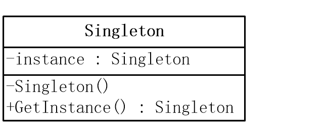
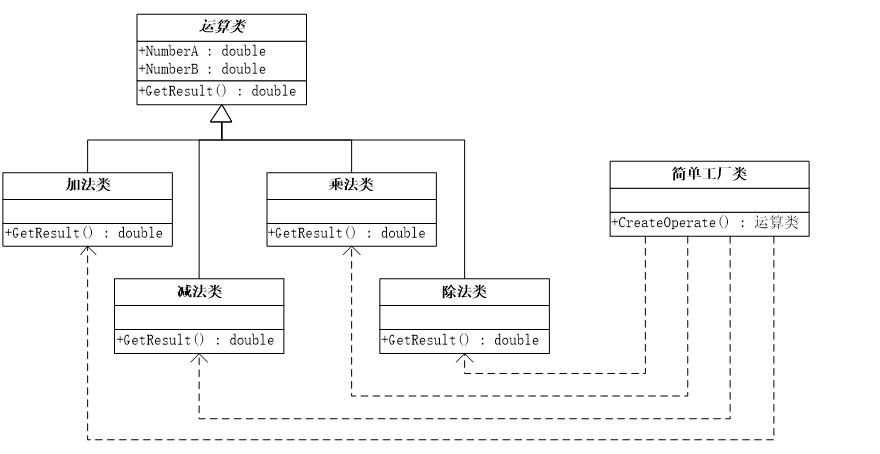
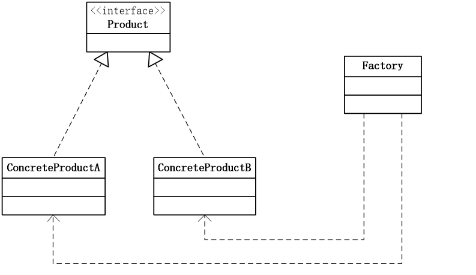
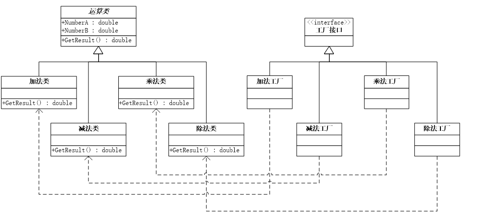
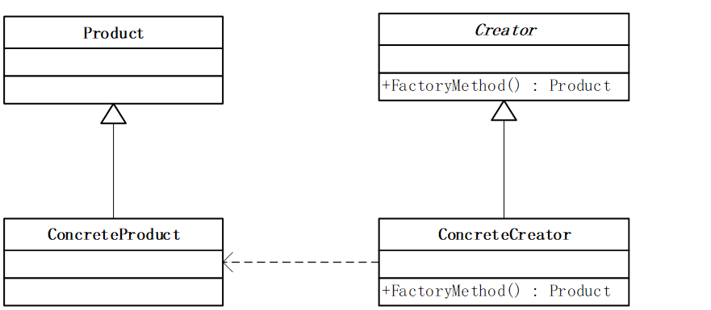
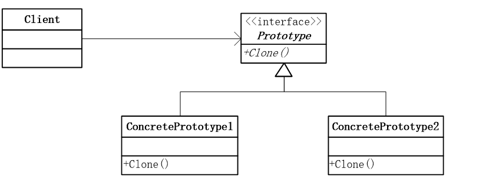

# 基于Java实现的软件设计模式

## [单例模式](src/Singleton)

### 模式动机
对于系统中的某些类来说，有且只能有一个实例。例如：一个系统只能有一个窗口管理器。系统中可以有许多打印机，但是只能有一个打印机正在工作。

我们怎样保证一个类只有一个实例并且这个实例易于被访问呢？

> 让类自身负责保存它的唯一实例。这个类可以保证没有其它实例被创建，并且它可以提供一个访问该实例的方法。这就是单例模式——Singleton Pattern。

### 模式定义

单例模式确保某一个类只有一个实例，而且自行实例化并向整个系统提供这个实例，这个类称为单例类，它提供全局访问的方法。

单例模式的要点:
1. 某个类只能有一个实例； 
2. 它必须自行创建这个实例；
3. 它必须自行向整个系统提供这个实例。

### 模式结构

### 模式分析

1. 私有化构造方法
2. 提供获取实例的方法
3. 获取实例的静态方法
4. 定义存储实例的属性
5. 把这个属性也定义成静态
6. 实现控制实例的创建

### 模式优缺点

模式优点：
1. 提供了对唯一实例的受控访问。 
2. 由于系统中只存在一个对象，因此可以节约系统资源，对于一些需要频繁创建和销毁的对象，单例模式无疑可以提高系统的性能。
3. 允许可变数目的实例。可以对单例模式进行扩展，设计指定个数的实例对象，即节省系统资源，又解决了由于单例对象共享过多有损性能的问题。
   
模式缺点：
1. 由于单例模式中没有抽象层，因此单例类的扩展有很大困难。 
2. 单例类的职责过重，在一定程度上违背了单一指责原则。因为单例模式即提供业务方法，又提供了创建对象的方法，将对象功能和创建耦合在一起。
3. 很多面向对象语言的GC垃圾回收技术，实例化的对象长期不使用，系统会认为是垃圾，自动销毁并回收资源，这将导致共享的单例对象状态的丢失。

### 模式使用场景

1. 系统只需要一个实例对象。例如，系统要求提供一个唯一的系列号生成器或资源管理器，或资源消耗太大而只允许创建一个对象。 
2. 客户调用类的单个实例只允许使用一个公共访问点。

### 模式扩展

1. 使用同步锁，解决高并发问题
2. 饿汉式单例
   > 懒汉式单例就是这个单例类的这个唯一实例new是在第一次使用 GetInstance()时实例化的 
   > 如果不调用 GetInstance()的话，这个实例是不会存在的，即为 null 
   > 形象点说呢，就是你不去动它的话，它自己是不会实例化的，所以可以称之为懒汉。
3. 懒汉式单例
   > 饿汉式单例的话，则刚好相反， 
   > 其由于肚子饿了，所以到处找东西吃，人也变得主动了很多，所以根本就不需要别人来催他实例化单例类的为一实例， 
   > 其自己就会主动实例化单例类的这个唯一类。
4. 管理多个对象

## 简单工厂模式

### 模式动机

考虑一个简单场景，一个软件系统可以提供多个外观不同的按钮，这些按钮都源自同一个基类，不过在继承基类后不同的子类修改了部分属性从而使得它们可以呈现不同的外观，如果我们希望不需要知道这些具体按钮类的名字，只需要知道按钮类的一个参数，并提供一个调用方便的方法，把该参数传入方法即可返回一个相应的按钮对象。

### 模式定义 

简单工厂模式(Simple Factory Pattern)：又称为静态工厂方法(Static Factory Method)模式，属于类的创建型模式，通过它根据自变量的不同返回不同的类的实例。简单工厂模式专门定义一个类来负责创建其它类的实例，被创建的实例通常都具有共同的父类。

### 模式结构 

### 模式优缺点

模式优点：
1. 工厂类含有必要的判断逻辑，可以决定在什么时候创建哪一个产品类的实例，客户端可以免除直接创建产品对象的责任，而仅仅“消费”产品。简单工厂模式通过这种做法实现了对象创建和使用的分离。
2. 客户端代码简洁，无需知道所创建具体产品的类名，只需知道对应的参数，可以减少使用者的记忆量。

模式缺点：
1. 工厂类集中了所有产品创建逻辑，一旦不能正常工作，整个系统都要受到影响。
2. 增加了系统中类的数量，增加了系统的复杂度和理解难度。
3. 系统扩展困难，一旦添加新产品就不得不修改工厂逻辑，有可能造成工厂逻辑过于复杂，不利于扩展。
4. 简单工厂模式通常使用静态工厂方法，造成工厂角色无法形成基于继承的等级结构。

### 模式应用

1. 根据各类算法的密码生成器。
2. 根据各类数据进行图表绘制。

## 工厂方法模式

### 模式动机

简单工厂模式如果需要增加新类型，那么需要修改工厂类的代码，这就使得整个设计在一定程度上违反了“开放封闭原则”。我们定义一个抽象的工厂类，而定义具体的工厂类来实现这个抽象按钮工厂类中定义的方法。抽象化的结果使这种结构可以在不修改具体工厂类的情况下引进新的产品。这一特点使得工厂方法模式具有超越简单工厂模式的优越性。

### 模式定义

工厂方法模式(Factory Method Pattern)：工厂方法模式又简称为工厂模式，也叫虚拟构造器(Virtual Constructor)模式或者多态模式，属于类的创建型模式。在工厂方法模式中，父类负责定义创建对象的公共接口，而子类则负责生成具体的对象，这样做的目的是将类的实例化操作延迟到子类中完成，即由子类来决定究竟应该实例化(创建) 哪一个类。

### 模式结构 

### 模式优缺点

模式优点：
1. 在工厂方法模式中，工厂方法用来创建客户所需要的产品，同时还向客户隐藏了哪种具体产品类被实例化这一细节，用户只需要关心所需产品对应的工厂，无需关心创建产品的细节，甚至无需知道产品类的类名。
2. 基于工厂角色和产品角色的多态性设计是工厂方法模式的关键。它能够使工厂可以自主确定创建何种产品对象，而如何创建这个对象的细节则完全封装在具体工厂内部。
3. 使用工厂方法模式的另一个优点是在系统中加入新产品时，无需修改抽象工厂和抽象产品提供的接口，无需修改客户端，也无需修改其它的具体工厂和具体产品，而只要添加一个新的具体工厂和具体产品即可。

模式缺点：
1. 在添加新产品时，需要编写新的具体产品类，而且还要提供与之对应的具体工厂类，类成对增加，将导致系统设计较为庞大，且运行时系统会有额外的开销。
2. 由于考虑到系统的可扩展性，需要引入抽象层，在客户端代码中均使用抽象层进行定义，增加了系统的抽象性和理解难度，且在实现的时候可能需要用到反射等技术，增加了系统的实现难度。

### 模式使用场景

1. 不能清楚知道所必须创建的对象的类。
2. 一个类希望由它的子类来指定它所创建的对象。
3. 将创建对象的职责委托给多个子类中的某一个，且不同子类提供不同实现。

## 原型模式(Prototype)

### 模式动机

有些对象的创建过程较为复杂，而且有时候需要频繁创建，原型模式通过给出一个原型对象来指明所要创建的对象的类型，然后用复制这个原型对象的办法创建出更多同类型的对象。这就是原型模式的动机。

### 模式定义 

1. 原型模式(Prototype Pattern)：它是一种对象创建型模式，用原型实例指定创建对象的种类，并且通过拷贝这些原型创建新的对象。原型模式允许一个对象再创建另外一个可定制的对象，无需知道任何创建的细节。
2. 工作原理是：通过将一个原型对象传给那个要发动创建的对象，这个要发动创建的对象通过请求原型对象拷贝原型自己来实现创建过程。

### 模式结构 

### 模式优缺点

模式优点：
1. 当创建新的对象实例较为复杂时，使用原型模式可以简化的对象的创建过程，通过复制一个已有实例可以提高新实例的创建效率。
2. 原型模式允许动态增加或减少产品类。
3. 原型模式具有给一个应用软件动态加载新功能的能力。 
4. 产品类不需要非得有任何事先确定的等级结构 。

模式缺点：
1. 原型模式的最主要缺点就是每一个类必须配备一个克隆方法。而且这个克隆方法需要对类的功能进行通盘考虑，这对全新的类来说不是很难，但对已有的类进行改造时，不一定是件容易的事。
2. 原型模式的另一个缺点是在实现深克隆时需要编写较为复杂的代码。

### 模式使用场景

1. 创建新对象成本较大(CPU，初始化)。
2. 系统要保存对象的状态，对象状态变化很小。
3. 当一个类的实例只有几个不同状态组合时，建立相应数目的原型并克隆它们可能比每次用合适的状态手工实例化更为方便。
